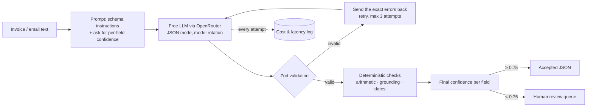

# Structured Extraction — schema-validated LLM output with a review queue

**Live demo:** https://llm-extract-psi.vercel.app

Paste an invoice or an email and get JSON that has passed a schema, a confidence score for every field, and a human review queue for anything doubtful. Every run is logged with its latency, tokens and cost. It's the pattern you want before LLM output is allowed to write into an accounting system or CRM.

## Architecture



## How it works

1. **Schema first.** `lib/schemas.js` defines the contract with Zod: required fields, `YYYY-MM-DD` dates that must be real dates, 3-letter ISO currency codes, money as plain numbers, at least one line item, enums for intent and urgency.
2. **Extraction.** The model is asked for `{"data": {...}, "confidence": {field: 0-1}}` in JSON mode, and told to copy values exactly as printed, even wrong ones, and never invent them. Free models are rotated on rate limits, errors or timeouts; `lib/openrouter.js` refuses any model id that isn't `:free`.
3. **Validate and retry.** If the reply isn't valid JSON or fails the schema, the precise Zod errors (for example `invoice_date: must be YYYY-MM-DD`) go back to the model, which tries again, up to 3 attempts. Every attempt is returned with its model, latency, tokens and errors.
4. **Deterministic checks.** The model's confidence is only a starting point. `lib/checks.js` recomputes quantity × unit price, the subtotal and the total, confirms that the invoice number, emails and amounts appear word for word in the source text, and checks date order. A failed check caps that field's confidence with a stated reason.
5. **Review and log.** Fields under 0.75 go to the review queue (approve, correct or reject). Each run's latency, token counts and cost are logged; with free models the cost is $0, and the log would work the same with paid pricing.

Try the "Invoice (subtotal is wrong)" sample: the line items add up to 180.50 but the invoice says 190.50, so `subtotal` and `total` are both flagged with the reason.

## Run locally

```bash
npm install
export OPENROUTER_API_KEY=...   # a free OpenRouter key is enough
npm run dev                     # http://localhost:3000
npm test                        # smoke test: the three samples through the real handler
```

## Limits

- Text in, text out. Scanned invoices would need OCR, and multi-page invoices with tables in odd layouts may need a layout-aware parser in front.
- Self-reported confidence from small free models is noisy, which is why deterministic checks can only lower it, never raise it.
- The review queue and log are stored in the browser (localStorage). A real deployment would put them in a database, gated behind auth.
- Free models can be slow or rate-limited; a run can take 5–20 seconds.
- Sample documents are made up.
